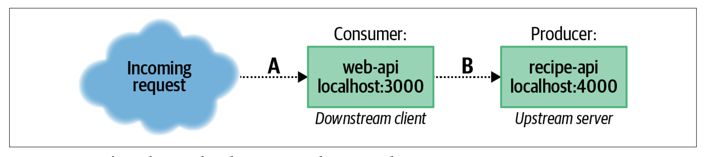

# distributed-node

## Chapter 1



### Consumer/Client

Web-Api is the downstream client of Recipe-API. It consumes the data from Recipe-API.
It receives the request from a browser and gets the data from Recipe-API.

### Producer/Server

Recipe-API is the upstream server of Web-API. It produces the data that is consumed by Web-API.

### Note

When a browser sends a request to Web-API, browser acts as client/consumer and Web-API acts as server/producer.

### How to Run:

#### Recipe-API

```bash
npm run start
```

Test the endpoint:

```bash
curl http://127.0.0.1:4000/recipes/42
```

It should return a JSON object.

To produce error, run change the id to anything other than 42.

#### Web-API

```bash
npm run start
```

Test the endpoint:

```bash
curl http://127.0.0.1:3000
```

It should return a JSON object.
